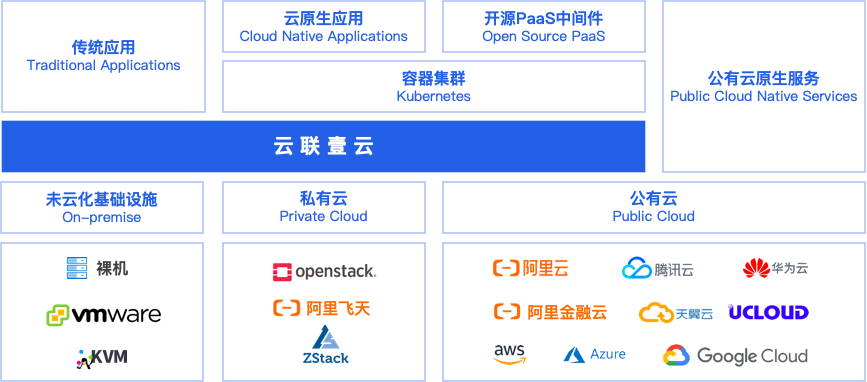
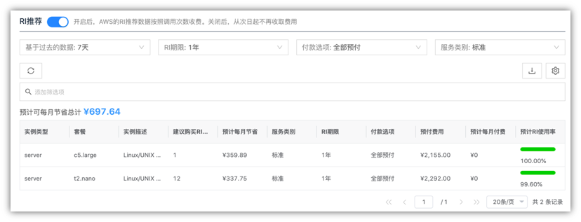
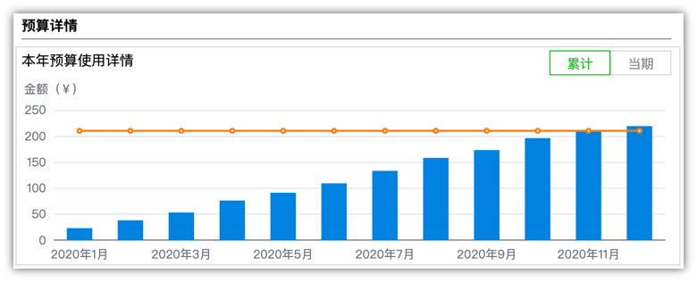
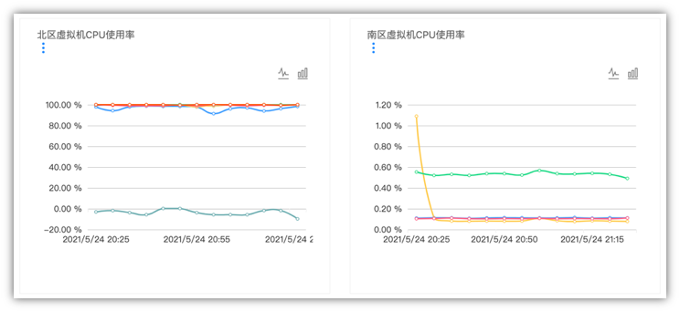
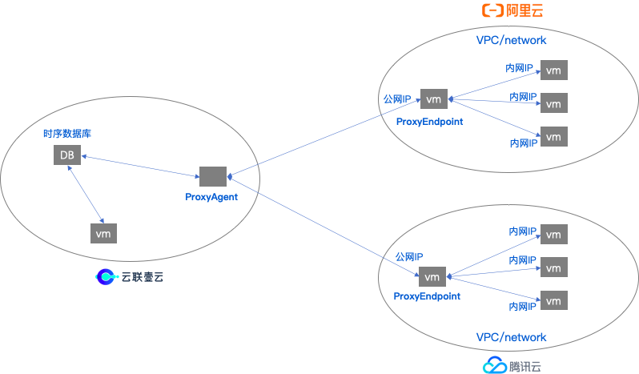
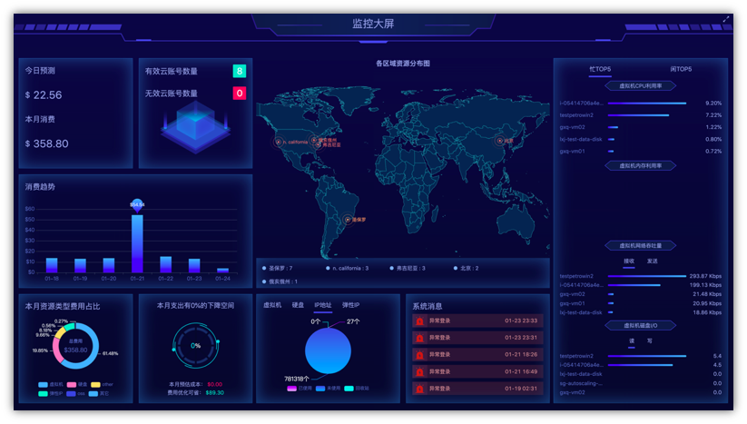
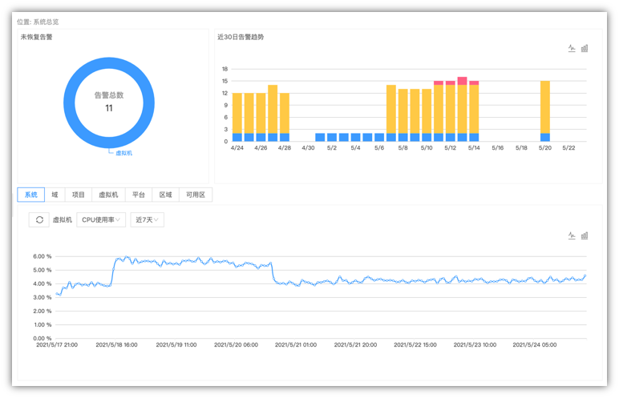
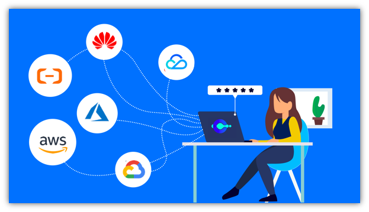
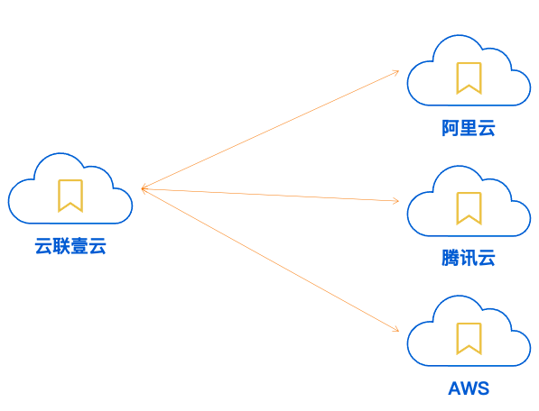

**作者:** 高现起

<!-- 大家好，我是高现起，目前在负责云联壹云融合云管理平台的产品工作，今天很高兴由我给大家介绍一下最新发布的3.7版本的新功能。 -->

今天围绕以下目录展开要讲的内容：

* 产品简介
* 3.7版本新功能介绍
* 功能规划

<!-- truncate -->

## 一、产品简介

目前，企业的IT资源属于无处不在的状态，根据 Flexera 2020 云状态（原 RightScale 云状态报告）报告，93%的企业实施了多云战略。虽然这一调查的依据是全球750家企业的云决策者，但是从国内的实际情况来说，数字可能没有那么大，趋势还是有的，就是多云已经是更多企业的选择了。

多云环境，我们又统称为异构IT基础设施，那么这种异构IT基础设施在给客户带来更优性能更优成本的同时，也会带来一些新的问题，例如我下边列举的5种不同角色的用户所遇到的问题：

* 运维工程师/开发工程师-如何统一管理所有的云计算资源？
* 财务专员-如何获取统一易读的公有云账单？
* 运维主管/开发主管-如何及时获取资源整体的使用情况？
* 财务主管-如何及时获取IT资源成本的使用结构？
* CTO/CIO-如何提高IT资源的ROI（投资回报率）？

我们早在2017年就关注到多云带来客户的问题，开始做云联壹云这款产品，希望能够帮助企业很好的解决这些问题。

云联壹云是一站式管理云计算资源的解决方案，希望帮助客户在一个地方管理本地IDC、私有云、公有云等IT资源，整体提高企业IT基础设施的管理效率。

从产品架构图上，我们可以看出，底层是一些异构资源，上层是一些应用或服务，云联壹云处于承上启下的作用，向下屏蔽异构的差异，向上提供一致的资源管理能力。

以上是我们最新版本也就是3.7版本的功能概览。

最底层是异构资源，中层就是我们云管理平台的功能概览，上层应用和服务。云管理平台的底层是多云的适配层，往上是基础的资源管理，包括计算、存储、网络、PaaS服务等，再往上是针对企业客户做的三大块的功能，依次是权限管理、统一监控和报警、成本管理包括私有云的计量计费公有云的账单分析和成本优化等等，面向用户层，我们针对不同的用户有不同的用户界面，包括管理员的系统管理视图，租户的租户管理视图，普通用户的项目视图，针对运维人员的climc命令行工具，针对开发人员，我们也有丰富的REST API以及各个开发语言的SDK。

这款产品能够带给客户3种价值：

* 省人省事-一站式采买、批量操作、一次配置，全网生效、统一获取易读账单
* 省钱-算好账、摊好钱、节成本
* 安全-统一认证、统一授权、免密登录

总而言之，云联壹云希望帮助用户解决异构IT基础设施带来的问题，充分发挥异构IT基础设施的优势。

## 二、3.7版本新功能介绍

3.7版本增加了不下30多项功能或更新，由于时间关系，今天我主要给大家介绍这5个方面的功能：

* 多云资源对接
* 多云账单管理
* 多云监控告警
* 多云权限管理
* 标签管理

### 1. 多云资源对接

在3.7版本，我们不断围绕客户需求，支持更多公有云资源的纳管：

* AWS平台对接Redis
* Azure平台对接RDS
* 阿里云和华为云NAS文件存储对接
* 移动云对接
* 阿里云、华为云NAT网关支持

### 2. 多云账单管理

2.1 支持AWS的预留实例分析，包括RI推荐及RI覆盖率，帮助客户用好RI，节约成本

2.2 支持价格对比功能，同配置全网比价，帮助客户发现便宜资源

2.3 支持所有平台费用报告及定期发送

2.4 支持预算管理功能，并且可以配置预算告警，防止费用超支

2.5 费用优化迭代，更多纬度节省费用，帮助用户发现更多可以优化成本的途径

### 3. 多云监控告警

3.1 支持自定义监控面板，一次定义，随时查看

3.2 报警策略支持函数及静默期设置，有效避免毛刺、报警泛滥等问题

3.3 支持自动化安装监控插件，可显示内存使用率等更多监控指标

3.4 大屏增加地图，可根据资源城市进行分布

3.5 增加监控总览，可以查看告警情况及平台各纬度使用情况

### 4. 多云权限管理

* 在一个地方创建及管理所有云平台的子账号，并分配权限
* 通过云管壹云控制台可一键跳转免密登录公有云控制台
* 员工离职，自动注销对应的公有云账号

### 5. 标签管理

* 标签支持CMP与公有云平台双向同步
* 标签搜索增强，支持特殊符号复杂搜索

除以上5大功能的更新外，我们其实还有很多细节更新，在这里就不在展开给大家介绍，感兴趣的同学可以看一下以下总结

## 三、功能规划

我们近期的功能规划主要是以下6个方面

* 京东云对接，我们有客户对京东云资源的纳管有需求
* Azure RI&CPP使用率、覆盖率以及推荐
* 产品内置负载均衡支持VPC网络（这个是我们私有云的功能）
* 公有云账单的二次定价，我们很多MSP厂商的需求
* 公有云WAF产品对接
* 监控报警的迭代，后期也会增加监控数据报表的功能

## 总结

好的，今天直播咱们就到这里，咱们简单的总结一下今天的内容：

产品简介，在多云趋势的背景下，云联壹云产品希望帮助用户解决异构资源管理问题，提升企业IT基础设施管理效率，以及云联壹云带给客户省人省事、省钱、安全三大产品价值；

3.7版本新功能介绍，主要给大家介绍了多云对接、多云账单管理、多云监控告警、多云权限管理以及标签管理5大模块的功能或更新；

功能规划，我们近期将会围绕京东云对接、AzureCPP、内置负载均衡支持VPC、公有云账单二次定价、公有云WAF对接、监控迭代5大方面展开产品的功能设计与实现。

感谢大家百忙之中参加我们的Meetup，下次直播再见。
