Cloudpods是完全自研的一套云平台，Golang是该平台的主要后端开发语言。本文介绍我们在平台开发迭代过程中关于Golang的经验以及在Golang上积累的框架和库，包括积累的Golang工具库，以及基于这些工具库实现的开发框架。

## 背景介绍

Cloudpods从2017年开始迭代开发。当时企业的IT环境已经不仅仅是本地的虚拟机以及裸金属，不少企业已经逐步采纳多云。所以Cloudpods平台作为新一代的云平台，需要不仅能管理本地IT环境中的虚拟机和裸金属，还能管理其他的云平台的资源，特别是公有云。实现所有的资源在一个平台上统一运维，操作，起到降低运维复杂度并提高企业IT运维效率的目的。

为了实现一个统一的多云平台，我们采用了最适合开发云原生应用的 Golang作为后端开发语言。前端则采用Vue框架。整个平台基于微服务框架。服务之间的认证鉴权基于OpenStack Keystone的框架（我们用Golang重新实现了Keystone）。

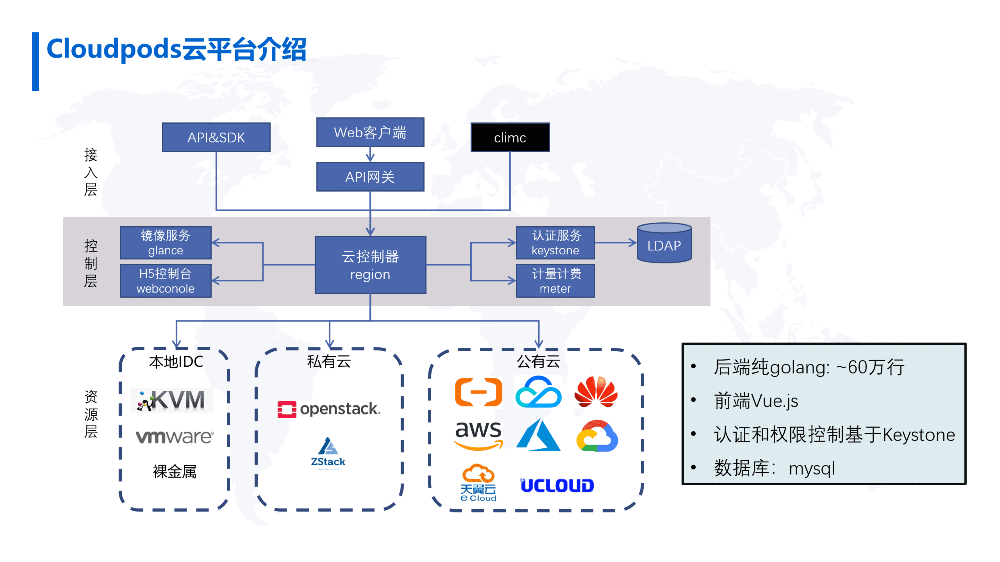

<!-- truncate -->

## Cloudpods Golang技术栈

云联壹云的Golang技术栈包含两部分：

首先是一个Golang的服务框架，所有的服务组件都基于同一套服务框架来开发，这个服务框架针对云平台的特点做出优化，适合快速开发云服务的API和异步任务逻辑。

其次是四个主要的Golang工具库 

* jsonutils：JSON序列化和反序列化 (https://github.com/yunionio/jsonutils)

* sqlchemy：模仿python SQLAlchemy的ORM库 (https://github.com/yunionio/sqlchemy)

* structarg：基于结构体的命令行参数生成和解析工具 (https://github.com/yunionio/structarg)

* pkg：其他一些辅助工具和方法 (https://github.com/yunionio/pkg)

## Golang框架

大部分Cloudpods服务都基于同一套服务框架开发，此框架的特点是针对云服务开发进行了适配和优化。

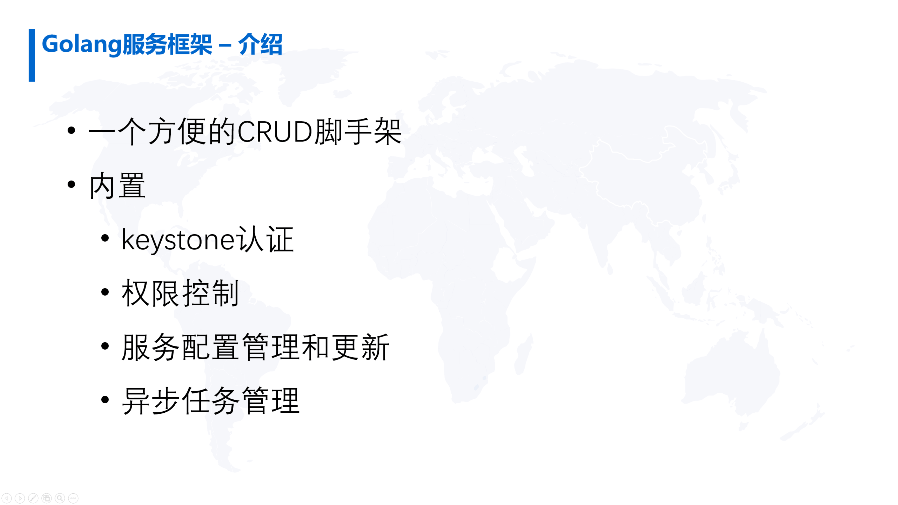

Cloudpods的服务框架可以简单地认为是一套方便CRUD的脚手架。云服务主要是对云资源的操作，比如云资源的创建、删除、更新等。服务框架内置了云资源的CRUD API的基础框架，再加上异步任务机制实现对云资源的复杂操作以及资源模型的修改。
 
除CRUD脚手架外，服务框架把认证，权限、配额等云平台特有的功能内置集成，使得认证和权限成为云平台默认的标配，同时简化相应功能的实现。

首先，服务组件之间的通信基于OpenStack Keystone认证，我们将keystone认证加到框架中，使得服务组件开发者不需关注keystone认证流程如何实现，就能天然支持keystone认证。其次，每一个API请求都受到权限的控制，因此把权限控制也集成到框架中。开发者在实现REST API时，基本不必为权限控制实现相应的代码，就能够天然地将权限控制集成到API中。


与此同时，每一个服务都有相应的配置参数，如何方便地管理各个服务的配置，允许对配置更新并同步到相应的组件使其生效，此过程相对复杂。我们将服务配置的功能集成到框架中，开发者采用框架不必考虑配置的存储、更新、服务器读取更新并使配置生效，这些复杂事宜已在框架中解决。

另外，还有异步任务的管理功能。平台是一个分布式的系统，云控制器需要去操作和管理数据计算节点、裸金属的管理节点。协调组件之间的复杂操作，例如将虚拟机、裸金属创建起来，这些都是分布式的任务管理，在平台中也嵌入了异步任务管理框架。如此即可较为方便地实现异步任务。

### CRUD脚手架原理

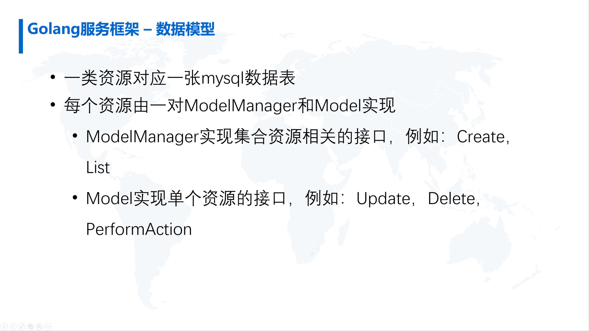

在平台中，每一种资源，例如主机，在底层对应到数据库MySQL表，资源的状态、相应的属性都记录到了MySQL表中。
 
用户通过调用API对数据进行操作，在数据操作的同时也能调用异步的任务去实现相应功能。落到底层代码中就是一种资源对应到一张MySQL表。

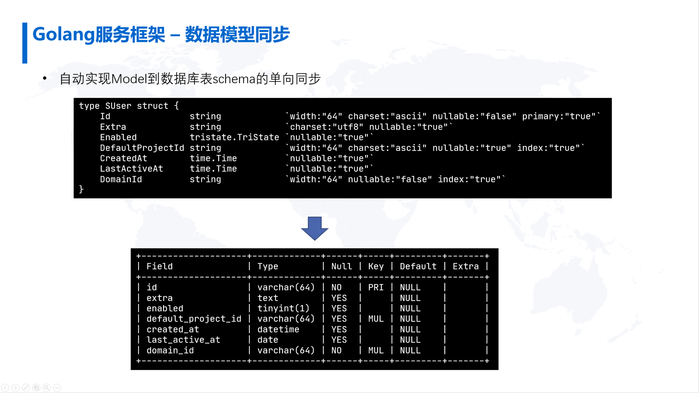

为了比较方便地实现对数据库MySQL记录的操作，针对每一个资源，都会对应到一对ModelManager和Model的数据结构。ModelManager数据结构对实现一类资源的集合操作，例如创建资源或者列表，而针对单个资源的操作，则通过Model来实现，实现对单个具体资源的更新、删除的操作。

每个资源的Model对应到Golang的一个结构体，该结构体有若干字段，每个字段代表资源的属性，例如有一个用户的资源包含用户的id、extra属性,用户是否enabled，用户何时创建，归属的域等。一个属性就是Golang结构体的一个字段，通过结构体字段的Tag属性定义每个字段在MySQL的数据库中对应的schema的定义。

例如Id这个字段，属性中有

```
width:"64" charset:"ascii" nullable:"false" primary:"true"
```

这些tags定义了Id这个字段是数据库里面的一个VARCHAR(64)的字段，并且他的字符集是ascii码，不能为空，并且是主键。所以通过tag将结构体的字段映射到了MySQL的schema的字段中，如此，每一个model通过字段的定义就能够清晰地映射到MySQL的数据表中。这样实现了Model的字段和MySQL的数据表定义的严格同步，每次程序启动时都会进行schema的同步检查，如果Model 的定义和数据表的定义不一致，就会执行相应的SQL的变更操作，将表的schema定义和Model的定义变更为一致。例如我们将Id的宽度从64改成80，在程序重启时就能够发现这个变化，然后将数据表该知道的宽度变更成80。如此实现通过代码定义的Model 和数据库中的表定义的严格同步。（另外，也支持离线变更数据库Schema，即只检测数据库Schema的变更，并且输出对应的SQL语句，通过专门的离线数据库schema变更工具实现数据库的变更。）

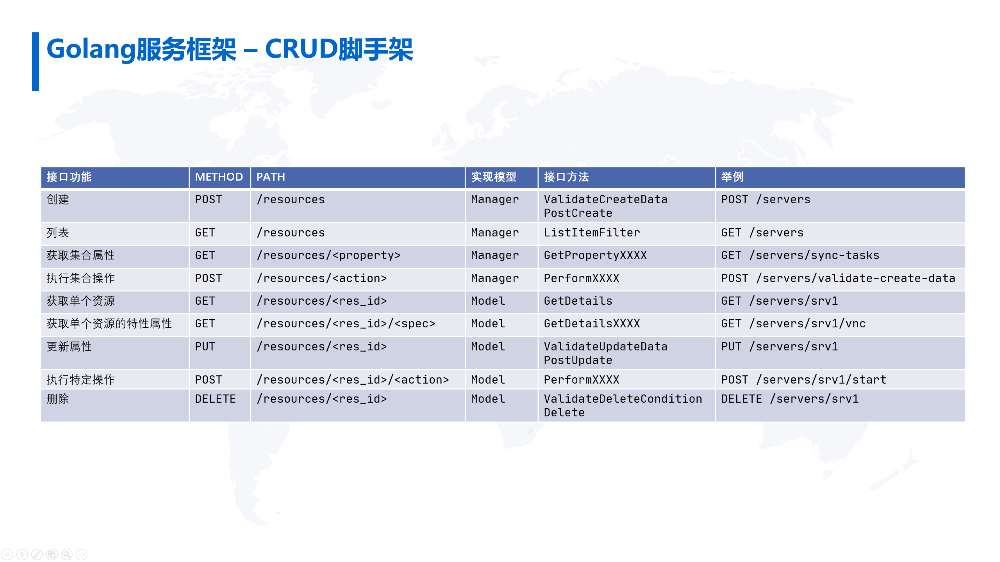

与此同时，每类资源都会提供一系列的API，此处列出了对一个资源会实现的九类API，包括创建、删除、更新、执行操作、获取详情、列表等操作。
 
每一个操作对应一个REST API，每一个REST API对应到后端代码中就对应到了每一个资源对应的ModalManager或者Model的方法。

例如获取资源详情的REST API是:

```
GET /resources/<res_id>
```

调用这个REST API其实就映射到相应的Model的GetDetails方法。为了实现获取资源的详情只需要去实现Model中的GetDetails的方法。

通过框架简化了实现云资源REST API的流程，只需要把相应的Model和ModelManager的方法根据输入实现相应逻辑，然后把正确的输出返回回去，这个REST API的功能即可实现。

如此诸如鉴权 、认证、配置同步等周边的工作在框架中实现，从而大大提升了开发效率并降低在开发过程中犯错的几率。

## Golang 工具库

下面介绍在Cloudpods开发过程中积累的Golang工具库。

### jsonutils

jsonutils是一个JSON序列化和反序列的工具库。


Golang 的标准库中带的JSON库是encoding/json，encoding/json是一个非常强大、非常高效的JSON序列化和反序列的工具库。encoding/json实现的是Golang的数据结构和对应json的字符串之间的相互转换。可以把Golang中的结构体通过Marshal的方式生成一个Json的字符串，或者把Json的字符串通过Unmarshal放到相应的结构体中的各个字段，这样即可访问结构体去获得json中的这些值。

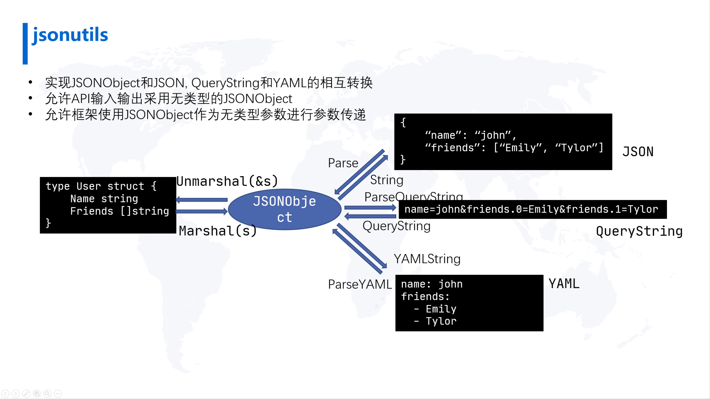

jsonutils与encoding/json相比的明显区别是中间增加了一个中间态，在jsonutils库里面实现一个中间态的通用类型的数据类型JSONObject。我们可以把数据结构Marshal（s）成JSONObject，JSONObject是Golang的interface，该interface可以进一步地序列化成json字符串。
 
这个中间态就是使用jsonutils的重要原因，通过通用类型的JSONObject就可以实现任意的结构体都可以Marshal（s）成JSONObject然后可以把JSONObject作为函数参数进行传递。

Golang是一个严格类型检查的静态语言，它的每一个变量都有相应的类型，我们的框架能够处理任意API的输入输出，如果没有中间的结构体，在处理API的输入输出时，输入是json字符串， 为了在程序上访问它， 就必须把它反序列化成严格的有类型结构体，这样一来就无法将框架变成通用框架。

如果引入通用的JSONObject，在框架中输入了json字符串， 先把它反序列化成JSONObject，这个JSONObject是通用类型的，这样就可以将JSONObject作为参数再进一步的向下传递，直到传递到具体相应的Model或者ModelManager相应的方法中，然后进一步把它转换成相应的结构体。这样就允许框架中使用已经反序列化好的JSONObject 并进行操作，可以实现比较通用的框架。

平台采用jsonutils最主要的原因是方便实现通用的框架。同时jsonutils还有其它特别之处，JSONObject 不仅能够转换成JSON字符串，也可以转换成QueryString 或者是把QueryString 反序列化成JSONObject 或者可以序列化成YAML的字符串。

这样可以实现更方便的功能，比如对于列表 GET这种读取的这种API，它的参数通常作为QueryString 嵌入到URL中。如此我们可以将QueryString参数在框架中反序列化成JSONObject，把它作为JSONObject输入参数传入到框架中。

对于其他类型的请求，可以把请求参数放在HTTP请求的body中的JSON字符串，我们同样可以把请求参数解析成JSONObject。这样，可以以同样的逻辑去处理嵌入到URL中的QueryString的参数以及嵌入到body 中的JSON的参数，可以做到统一处理出入参数的逻辑。

另外jsonutils 还有还有一些针对云平台API做的一些特别的一些处理。较为特别的一点是支持结构体字段的版本变更。

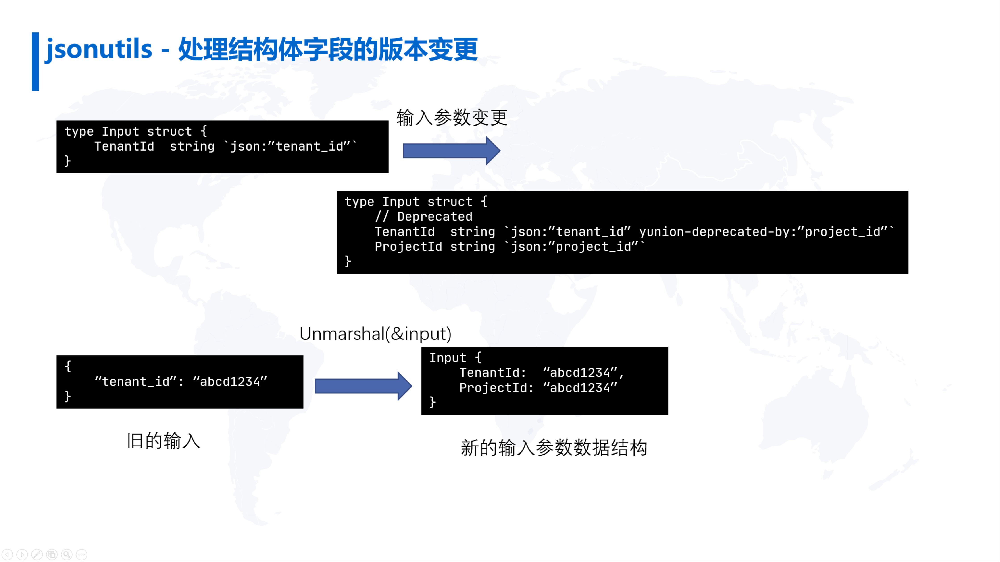

以下为举例说明：
 
例如有一个输入参数的结构体称为Input，有一个字段是TenantId，用来标识用户的租户ID。

随着版本的升级，希望将TenantId统一改名为ProjectId，这种升级如果不做任何处理，将可能出现接口兼容性的问题，在变更之前这个字段是TenantId，变更之后这个字段就只能是ProjectId。升级后，使用TenantId的客户端就不能正确访问这个接口。

在这个结构体中，我们增加了特别的tag：yunion-deprecated-by，把这个结构体input升级为新的input的结构之后，增加了ProjectId的字段，用它来代表新的TenantId的属性。

旧的TenantId仍然保留，但是在结构体的tag中加了名称为yunion-deprecated-by的tag，这个Tag的值是ProjectId。表明TenantId的字段已经被ProjectId这个字段deprecated。

代码在处理时，如果旧客户端的参数中只有TenantId，此时框架就会将TenantId的值根据yunion-deprecated-by这个tag 指引同时copy到ProjectId的字段中。

这样，如果旧的客户端去访问新的接口，在新的接口中同样可以用ProjectId这个字段去获取这个值。这样保证了旧的客户端可以访问升级后的接口。

### sqlchemy

Sqlchemy是前文介绍的Golang服务框架中实现Model和数据库表映射的底层实现。
 
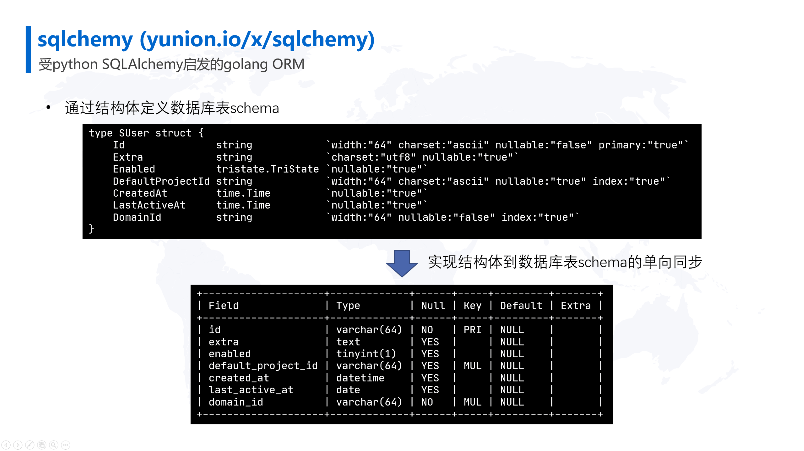

Sqlchemy实现了Golang的数据结构到MySQL表单向同步，能够根据结构体字段的定义以及字段中tag的定义，生成精确的MySQL的schema。

Sqlchemy能保证数据库中schema总是严格地和结构体定义保持一致，如果不一致，能够自动地变更数据库，将数据库Schema和结构体的定义变更为一致。

Sqlchemy另一个重要特性是能够实现结构化的数据库查询语句。
 
这里举一个简单的例子。如上图所示，我们要对UserTable表进行一个查询。首先实例化UserTable实例，然后调用它的Query接口返回一个SQuery实例，再调用Equals方法，进行过滤。这样就表示在查询user表，并且要求domain_id 这个字段要等于指定的值。Sqlchemy在执行时会把结构体的结构化查询变成SQL的查询语句，并送到MySQL进行执行。

使用这种代码化的数据库查询方式的优点是避免了人工拼凑SQL容易出现的问题,并且Golang是一个严格的静态语言。可以通过Golang的语法检查保证查询语句的正确性。

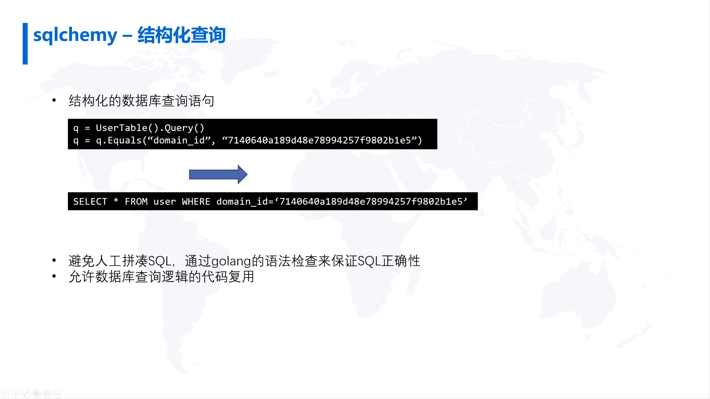

另一个好处是因为把SQL的查询代码化，这样就可以把数据库查询的逻辑进行一定程度的代码复用，这样就不用重复同样的查询语句，而是调用一个方法，这个方法中就嵌入了SQL的查询逻辑。

框架中所有数据库的操作查询都用到sqlchemy，在一定程度上保证框架代码中SQL语句的正确性以及执行效率。

### structarg

还有一个比较重要一个库是structarg，这个库的作用是将程序的命令行参数或者配置文件信息和代码中的结构体做严格的映射。

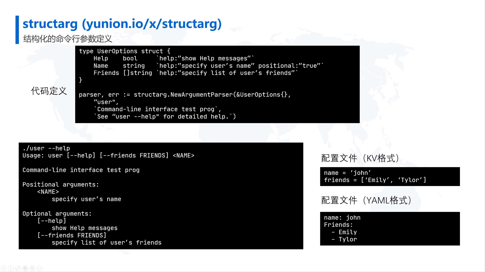

这样可以基于结构体自动生成程序输入参数的提示，并且能够根据命令行参数将参数中的值反序列化放到结构体中， 或者是将对应配置文件中的参数反序列化到结构体中，在程序中就可以通过访问结构体的字段去访问相应参数的值。

如此即可比较方便地在程序中使用配置的信息，这里举个例子。
假设定义了UserOption的结构体，这个结构体tag中包含一个help的tag，这个tag的定义了结构体的每个字段的帮助信息。将其初始化并进行程序编译之后，如果命令行中执行带help的参数的话，其将会把这些帮助信息展现出来。

同时，用户也可以在命令行参数中去用这些参数把值传递到程序中，在程序代码中即可通过访问结构体去访问这些参数。

同时，也支持配置文件的输入，而且配置文件同时支持Key=Value格式和YAML格式。

这样可以将程序的配置文件的配置信息通过结构体定义下来，程序就能够自动地识别配置文件的信息，然后将信息放到结构体中访问。

框架中对配置管理的基础就是structarg的功能，利用该功能将每一个服务的配置用结构体来定义，并且配置的信息会存到数据库中，在数据库的信息进行修改之后，框架会把数据库中的配置信息拉取下来，然后把它反序列化到结构体中，程序中能够感知到配置的变更，并做出相应的配置变更处理。

### pkg

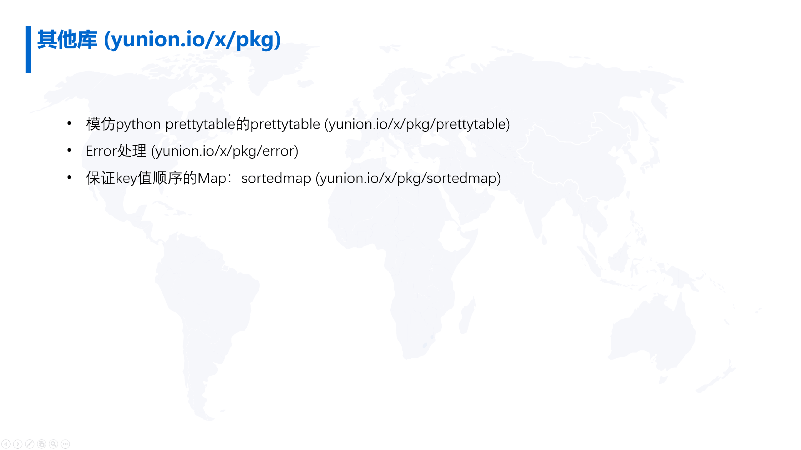

除去三个比较重要的库之外， 还有一些其他辅助的工具库在pkg这个库中。包括模仿python的prettytable的格式化输出数据的库，错误处理库，保证key顺序的map的实现等。这里就不一一介绍，感兴趣的读者可以阅读相关源码。
