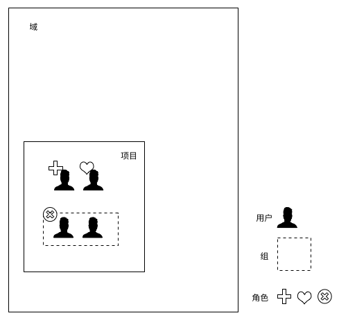

# 认证服务原理

平台认证服务组件(keystone)最早即采用OpenStack的keystone组件，2019年采用golang重构实现了keystone组件，保持和OpenStack Keystone v3.0 API的兼容，并且扩展了认证源（identity_provider）和权限（policy）的实现，使得更容易实现复杂的认证源（如SAML 2.0）和权限体系。

目前认证服务组件（keystone）的功能主要有三个：

- 提供用户认证体系，向其他系统证明一个用户是否合法，并提供用户的属性。涉及的概念有认证源(identity_providers)，域(domains)，用户(user)和组(group)。
- 提供资源归属体系，向其他系统提供一套域和项目的资源归属体系。设计的概念有域(domains)，项目(projects)。
- 提供权限体系，定义用户／组对资源的权限定义。涉及的概念有项目(projects)、角色(roles)和权限策略(policies)。

此外，认证服务还提供了以下功能：

* 服务目录，提供服务以及服务endpoint的URL信息，包括region，service，endpoint等信息。
* 配置管理，为各个服务提供一个服务配置管理的基础设置，包括对配置信息的增删改查功能。

为了实现多租户的效果，认证服务提供了域的概念，一个域下有一个完整的用户认证体系和资源和权限体系，从而允许一个域管理员能够完全自治地管理本域的用户、组、项目、角色和权限策略。

相关的资源和概念如下：

| Resource         | 名称   | 说明                                                                           |
|------------------|--------|--------------------------------------------------------------------------------|
| IdentityProvider | 认证源	| 代表认证（域／用户／组）信息的来源，系统内置一个sql的认证源。支持LDAP的认证源。|
| Domain           | 域	    | 代表一个认证的子集，包含对应的用户，组，项目，角色，策略。有一个缺省域default。| 
| User             | 用户   | 资源Operator。用户是执行某个具体操作的实体，但是并不拥有资源。用户要访问资源，必须加入特定的项目，具备特定的权限。系统有一个默认的账号sysadmin，该用户在系统部署时自动创建。|
| Group            | 组     | 用户的集合。把组加入一个项目，则组内用户自动加入该项目。|
| Project          | 项目   | 资源Owner。资源必须归属于某个项目。系统有一个默认的项目system，该项目在系统启动时自动创建，系统管理员默认加入该项目。|
| Role             | 角色   | 用户在项目的角色，用来确定该用户的角色。用户在一个项目可以有多个角色。用户在该项目下的权限是所有匹配策略定义的权限的最高权限。系统预定义了一些列角色。其中包含admin角色。|
| Policy           | （权限）策略   | 定义了在指定项目和指定角色的用户的权限。系统预定义了一系列策略。|

其中，域，项目，用户，组，角色的关系如下图所示：系统中有可以有多个域，每个域下的资源属于诺干项目。用户或者用户的组以特定角色加入项目，从而可以使用项目中的资源。用户和组的认证信息来源于认证源。用户和组在项目内的权限由该用户或组在项目内的角色对应的权限策略决定。

