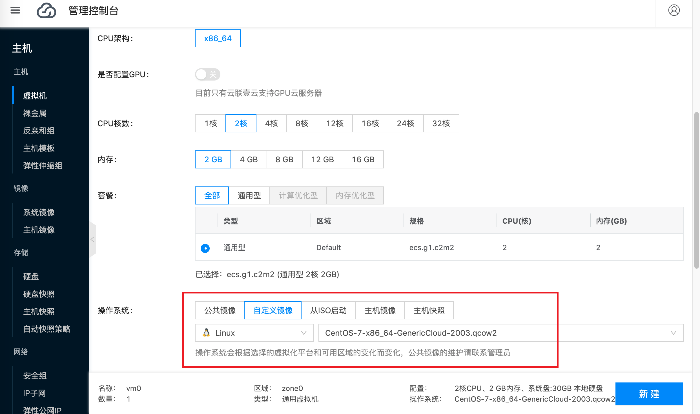

# 新建虚拟机

介绍如何在本地 IDC 环境中新建虚拟机。

:::tip
创建虚拟机之前，需要提前创建好IP子网，上传虚拟机镜像，启用宿主机等操作。
:::

## 通过前端创建

在 **主机** 菜单，选择 **虚拟机**，选择 **新建**。在此界面输入主机名，选择镜像和IP子网，创建虚拟机。截图如下： 

输入虚拟机名称 vm0：


根据需要选择虚拟机配置和镜像，比如下面截图的配置为： CPU 2核，内存2G，镜像CentOS-7-aarch64-GenericCloud-2003.qcow2：



选择虚拟机网络，这里选择 vpc0 里面的 vnet0 子网，然后点击新建：


等待虚拟机创建好后，状态变为 **运行中**，可以点击 **密码** 获取登录信息，然后点击 **远程控制** 按钮里面的 **VNC 远程终端** 登录虚拟机。

。

:::tip
其他的登录方式可以参考：[登录虚拟机](./connect)。
:::


## 通过 climc 创建

`climc server-create` 命令提供创建云主机的操作。 因为平台可以同时管理多个私有云和公有云，不同供应商有各自的认证方式，在创建云主机之前需要做一些不同的准备工作。


创建机器命令为 `server-create`，可以使用 `climc server-create --help` 查看创建 server 的所有参数，常用的参数如下：

|     参数名称    |   类型   |                           作用                           |
|:---------------:|:--------:|:--------------------------------------------------------:|
|      --ncpu     |    int   |                      虚拟机 cpu 个数                     |
|      --disk     | []string |   指定创建的系统盘镜像，指定多次表示虚拟机创建多块磁盘   |
|      --net      | []string | 指定虚拟机使用的网络，指定多次将在虚拟机里面添加多个网卡 |
|  --allow-delete |   bool   |                      允许删除虚拟机                      |
|   --auto-start  |   bool   |                      创建完自动启动                      |
|    --password   |  string  |                      设置虚拟机密码                      |
|     --tenant    |  string  |                     创建到指定的项目                     |
| --prefer-region |  string  |                    创建到指定的 region                   |
|  --prefer-zone  |  string  |                     创建到指定的 zone                    |
|  --prefer-host  |  string  |                     创建到指定的 host                    |


:::tip
1. 名称、内存或者套餐类型在创建主机时必须使用;
2. 系统盘的镜像通过 `image-list` 或者 `cached-image-list`，公有云的镜像列表通过 `cached-image-list` 接口查询，参考: [查询镜像](../glance/sysimage/show);
:::


下面以举例的方式创建机器：

待创建规格:

| 名称 | 套餐    | 内存 | cpu | 系统盘                 | 网络 | 其他                                                                           |
|------|---------|------|-----|------------------------|------|--------------------------------------------------------------------------------|
| vm1  | -       | 4g   | 4   | centos7.qcow2 60g      | net1 | 2块数据盘， 一块100g ext4 挂载到 /opt，另外一块 50g xfs 挂载到 /data; 自动启动 |
| vm2  | -       | 2g   | 2   | ubuntu18.04.qcow2 100g | net2 | 允许删除                                                                       |
| vm3  | t2.nano | -    | -   | centos6.qcow2          | net3 | -                                                                              |

```bash
# 创建 vm1
$ climc server-create --disk centos7.qcow2:60g --disk 100g:ext4:/opt --disk 50g:xfs:/data --ncpu 4 --net net1 --auto-start --mem-spec 4g vm1

# 创建 vm2
$ climc server-create --disk ubuntu18.04.qcow2:100g --net net2 --allow-delete --auto-start --ncpu 2 --mem-spec 2g vm2

# 创建 vm3
$ climc server-create --instance-type t2.nano --disk centos6.qcow2 --net net3 --auto-start vm3
```

### 主机名表达式举例说明

主机（包括虚拟机和裸金属）名称支持表达式，表达式格式为：$\{变量名\}，变量名需要小写。如$\{host\}，则虚拟机名称显示为创建虚拟机的宿主机的名称；$\{region\}-$\{zone\}，则显示为区域名-可用区名称等。

支持的变量名如下：

 | 变量名          | 举例                                 | 说明                                |
 | ---------       | ----------                           | ---------                           |
 | charge_type     | postpaid                             | 计费方式                            |
 | cloud_env       | onpremise/public/private             | 用于区分本地IDC、私有云和公有云平台 |
 | cloudregion_id  | default                              | 区域id                              |
 | cpu             | 1                                    | CPU数量                             |
 | host            | gobuild                              | 主机名                              |
 | host_id         | 16f49f8a-88cc-4715-8870-f78130196fa9 | 主机id                              |
 | ip_addr         | 192.168.1.1                          | IP地址                              |
 | mem             | 1024                                 | 内存                                |
 | os_distribution | 操作系统                             | CentOS                              |
 | os_type         | Linux                                | 操作系统类型                        |
 | os_version      | 6.9                                  | 操作系统版本                        |
 | owner_tenant    | system                               | 项目                                |
 | owner_tenant_id | d56f5c37e36a42b782d7f32b19497c4c     | 项目id                              |
 | region          | Default                              | 区域                                |
 | hypervisor      | kvm                                  | 虚拟化方式                          |
 | res_name        | server                               | 资源类别                            |
 | template_id     | 5199f56b-01c2-425c-8e29-0179d283e4a3 | 模板id                              |
 | zone            | zone1                                | 可用区                              |
 | zone_id         | 00f3f3c6-1d16-4053-81f1-4cb092f418f5 | 可用区id                            |
